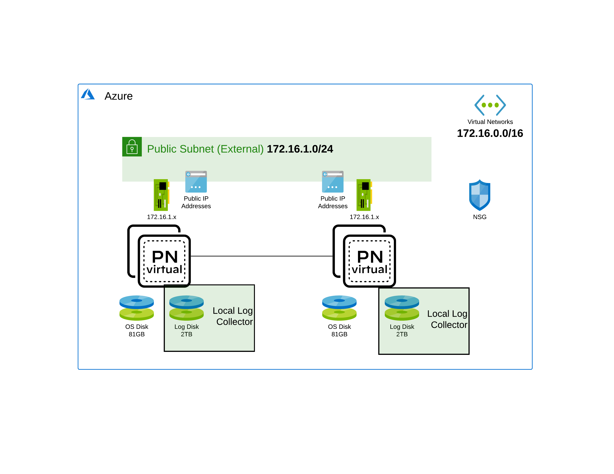

This TF file willl spin up 2 Panorama HA in a same resource group and vnet
Plesae modify variables.tf as necessary
Prefix variable will add prefix in front of your resources, modify this with your username i.e arivai this will create arivai-nsg in the resource group

run the below commands

git clone https://github.com/bartoqid/Panorama-HA-Azure.git

Modify variables

then run

terraform init
terraform plan
terraform apply -auto-approve

